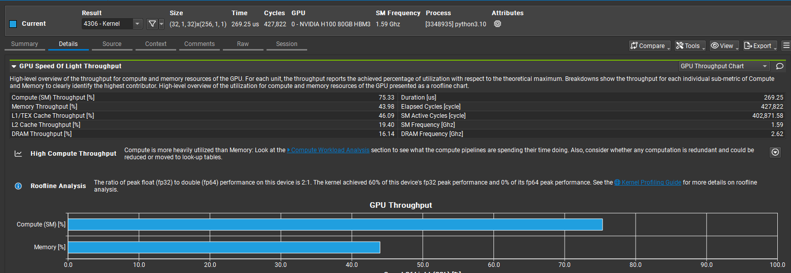

# ncu profile 的使用指南

## 1. ncu 的安装与profile生成
Nsight Compute安装包在 [https://developer.nvidia.com/tools-overview/nsight-compute/get-started](https://developer.nvidia.com/tools-overview/nsight-compute/get-started) 可以获得。


可以通过`ncu --help`来查看ncu命令的参数
```
General Options:
  -h [ --help ]                         Print this help message.
  -v [ --version ]                      Print the version number.
  --mode arg (=launch-and-attach)       Select the mode of interaction with the target application:
                                          launch-and-attach
                                          (launch and attach for profiling)
                                          launch
                                          (launch and suspend for later attach)
                                          attach
                                          (attach to launched application)
  -p [ --port ] arg (=49152)            Base port for connecting to target application
  --max-connections arg (=64)           Maximum number of ports for connecting to target application
  --config-file arg (=1)                Use config.ncu-cfg config file to set parameters. Searches in the current 
                                        working directory and "$HOME/.config/NVIDIA Corporation" directory.
  --config-file-path arg                Override the default path for config file.

Launch Options:
  --check-exit-code arg (=1)            Check the application exit code and print an error if it is different than 0. 
                                        If set, --replay-mode application will stop after the first pass if the exit 
                                        code is not 0.
  --injection-path-32 arg (=../linux-desktop-glibc_2_11_3-x86)
                                        Override the default path for the 32-bit injection libraries.
  --injection-path-64 arg               Override the default path for the 64-bit injection libraries.
  --preload-library arg                 Prepend a shared library to be loaded by the application before the injection 
                                        libraries.
  --call-stack                          Enable CPU Call Stack collection.
  --nvtx                                Enable NVTX support.
  --support-32bit                       Support profiling processes launched from 32-bit applications.
  --target-processes arg (=all)         Select the processes you want to profile:
                                          application-only
                                          (profile only the application process)
                                          all
                                          (profile the application and its child processes)
  --target-processes-filter arg         Set the comma separated expressions to filter which processes are profiled.
                                          <process name> Set the exact process name to include for profiling.
                                          regex:<expression> Set the regex to include matching process names for 
                                        profiling.
                                            On shells that recognize regular expression symbols as special characters,
                                            the expression needs to be escaped with quotes.
                                          exclude:<process name> Set the exact process name to exclude for profiling.
                                          exclude-tree:<process name> Set the exact process name to exclude
                                            for profiling and further process tracking. None of its child processes
                                            will be profiled, even if they match a positive filter.
                                        The executable name part of the process will be considered in the match.
                                        Processing of filters stops at the first match.
                                        If any positive filter is specified, only processes matching a positive filter 
                                        are profiled.
  --null-stdin                          Launch the application with '/dev/null' as its standard input. This avoids 
                                        applications reading from standard input being stopped by SIGTTIN signals and 
                                        hanging when running as backgrounded processes.

Attach Options:
  --hostname arg                        Set hostname / ip address for connection target.

Common Profile Options:
 ...
```
在正常情况下，大多数参数并不需要使用，通常使用以下命令即可
```
ncu --set full -o *** python3 xxx.py
```
完成后会在服务器上产生一个 `***.ncu-rep` 文件, 可以在本地用 Nsight Compute 打开。

## 2. ncu profile 的分析
上一节介绍了 ncu 生成 profile 的方法，本节将以一个具体案例来介绍如何解读 profile。
在 `reference.py` 里实现了一个基本的 attention 结构，通过 `ncu -o attn_fwd --set full python test_attention.py`生成一个名为 `attn_fwd.ncu-rep` 的文件，生成过程的日志如下所示：
```
==PROF== Connected to process 3348935 (/usr/bin/python3.10)
==WARNING== Unable to access the following 6 metrics: ctc__rx_bytes_data_user.sum, ctc__rx_bytes_data_user.sum.pct_of_peak_sustained_elapsed, ctc__rx_bytes_data_user.sum.per_second, ctc__tx_bytes_data_user.sum, ctc__tx_bytes_data_user.sum.pct_of_peak_sustained_elapsed, ctc__tx_bytes_data_user.sum.per_second.

==PROF== Profiling "distribution_elementwise_grid..." - 0: 0%....50%....100% - 37 passes
==PROF== Profiling "distribution_elementwise_grid..." - 1: 0%....50%....100% - 37 passes
==PROF== Profiling "distribution_elementwise_grid..." - 2: 0%....50%....100% - 37 passes
==PROF== Profiling "unrolled_elementwise_kernel" - 3: 0%....50%....100% - 37 passes
==PROF== Profiling "unrolled_elementwise_kernel" - 4: 0%....50%....100% - 37 passes
==PROF== Profiling "unrolled_elementwise_kernel" - 5: 0%....50%....100% - 38 passes
==PROF== Profiling "vectorized_elementwise_kernel" - 6: 0%....50%....100% - 38 passes
==PROF== Profiling "elementwise_kernel" - 7: 0%....50%....100% - 38 passes
==PROF== Profiling "elementwise_kernel" - 8: 0%....50%....100% - 38 passes
==PROF== Profiling "Kernel" - 9: 0%....50%....100% - 37 passes
==PROF== Profiling "softmax_warp_forward" - 10: 0%....50%....100% - 37 passes
==PROF== Profiling "vectorized_elementwise_kernel" - 11: 0%....50%....100% - 37 passes
==PROF== Profiling "elementwise_kernel" - 12: 0%....50%....100% - 37 passes
==PROF== Profiling "sm80_xmma_gemm_f32f32_f32f32_..." - 13: 0%....50%....100% - 37 passes
==PROF== Profiling "unrolled_elementwise_kernel" - 14: 0%....50%....100% - 37 passes
==PROF== Profiling "unrolled_elementwise_kernel" - 15: 0%....50%....100% - 38 passes
==PROF== Disconnected from process 3348935
==PROF== Report: /share_data/data-before/zzd/repos/cuda_learning/05_cuda_mode/ncu_profile/attn_fwd.ncu-rep
```
使用 Nsight Compute 打开这个文件。


### **Summary**
从第一页看起，该页主要显示的是 summary， 其中序号 0-15 则是依次运算的kernel，其信息包括：
- ID: 每个函数的唯一标识符。
- Estimated Speedup: 估计的加速比，表示如果优化这个函数可能带来的速度提升。
- Function Name: 函数的名称。
- Demangled Name: 去掉修饰符的函数名称。
- Duration: 函数执行时间（以ns为单位）。
- Runtime Improvement: 估计的运行时间提示（以ns为单位），表示如果优化这个函数可能带来的运行时间提升。
- Compute Throughput: 计算吞吐量。SM 吞吐量假设在 SMSPs 间负载平衡理想的情况下 （此吞吐量指标表示在所有子单元实例的经过周期内达到的峰值持续率的百分比）。
- Memory Throughput: 内存吞吐量。计算内存管道吞吐量 （此吞吐量指标表示在所有子单元实例的经过周期内达到的峰值持续率的百分比）。
- Registers: 每个线程使用的寄存器数量。
- GridSize：kernel启动的网格大小。
- BlockSize：每个Block的线程数。
- Cycles：指令周期。

最上部的`Result`默认显示的是`ID=0`的 kernel 运行的部分信息，包括GPU型号及频率。

从该图可以比较快速的得到一些信息：
- Memory-bound：Memory Throughput 明显高于 Compute Throughput 的 kernel ，例如 `ID=6,11`
- Compute-bound：Compute Throughput 明显高于 Memory Throughput 的 kernel ，例如 `ID=9,13`


### **Details**

- GPU Speed Of Light Throughput





